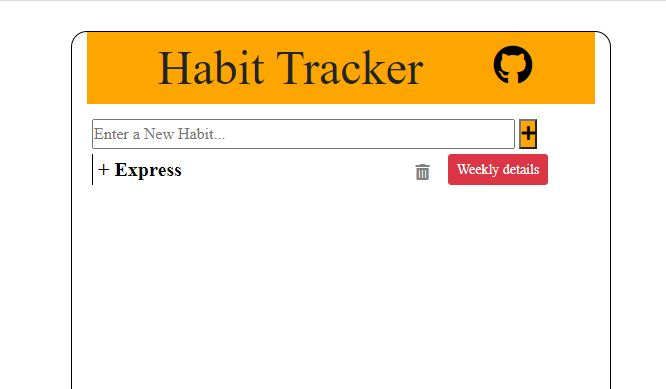

# Habit Tracker

A small web application for tracking daily habits. You can add habits, remove them, and mark each habit as Completed, Incomplete, or None for the current day and the five days before it.



## Features

- Add a new habit from the home page.
- List all saved habits and delete any of them.
- "Weekly details" view for each habit showing the last 6 days (today and the 5 previous days).
- Set the status of each of those days to Completed, Incomplete, or None using a dropdown. Days with no recorded status show "None".
- Habits and their daily statuses are stored in MongoDB.

## Tech Stack

- Node.js with Express 4
- EJS templates for server-side rendering
- MongoDB with Mongoose 5
- Bootstrap 4, jQuery, Popper.js and Font Awesome (loaded from CDNs)

## Project Structure

```
Habit-Tracker/
├── index.js                     # App entry point: Express setup, view engine, static files, server start
├── config/
│   └── mongoose.js              # MongoDB connection
├── models/
│   └── habit.js                 # Habit schema (name, days[])
├── controller/
│   ├── home_controller.js       # List, create and delete habits
│   └── details_controller.js    # Last-6-days view and status updates
├── routes/
│   ├── index.js                 # Main routes
│   └── prevdays.js              # Status-change route
├── views/
│   ├── home.ejs                 # Home page (habit list + add form)
│   └── prevdays.ejs             # Weekly details page
├── assets/css/                  # Stylesheets (home.css, prevdays.css)
├── images/                      # Screenshot used in this README
└── package.json
```

## Prerequisites

- Node.js and npm
- A MongoDB database (a local MongoDB server or a MongoDB Atlas cluster)

## Setup

1. Clone the repository and install dependencies:

   ```bash
   git clone https://github.com/iSouvikKhan/Habit-Tracker.git
   cd Habit-Tracker
   npm install
   ```

2. Configure the database connection. The MongoDB connection string is hard-coded in `config/mongoose.js` (the `connection` constant). Replace it with your own connection string. A commented-out line for a local database (`mongodb://127.0.0.1/habit_Trackerdb`) is included in that file if you want to use a local MongoDB server instead.

## Running the App

Start the server with Node:

```bash
node index.js
```

Note: the `start` script in `package.json` is set to `index.js` rather than `node index.js`, so `npm start` will not launch the server as-is. Use the command above.

The server listens on the port given by the `PORT` environment variable, or `8000` by default. To use a different port:

Linux / macOS:

```bash
PORT=3000 node index.js
```

Windows (PowerShell):

```powershell
$env:PORT=3000; node index.js
```

Windows (Command Prompt):

```cmd
set PORT=3000
node index.js
```

Then open `http://localhost:8000` (or the port you chose) in your browser.

## Usage

- **Home page (`/`)**: type a habit name and click the plus button to add it. Click the trash icon to delete a habit, or "Weekly details" to open its tracking page.
- **Weekly details (`/details?id=<habitId>`)**: shows the habit's last 6 days. Use the dropdown on each day to set its status to Completed, Incomplete, or None. Click "HOME" to go back.

## Routes

| Method | Path            | Description                                  |
|--------|-----------------|----------------------------------------------|
| GET    | `/`             | List all habits                              |
| POST   | `/add-Habit`    | Create a habit (form field `habitName`)      |
| GET    | `/delete`       | Delete a habit (`id` query parameter)        |
| GET    | `/details`      | Show last 6 days for a habit (`id`)          |
| GET    | `/changestatus` | Set a day's status (`id`, `date`, `status`)  |
